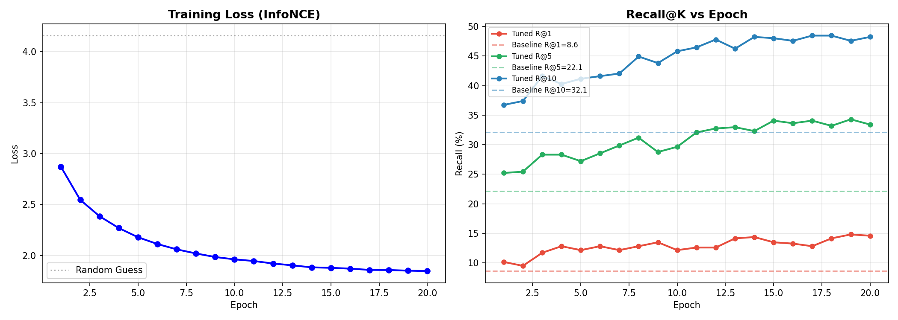

{
 "cells": [
  {
   "cell_type": "markdown",
   "id": "7df8859b-c83e-466e-96c5-c1a6e52f398d",
   "metadata": {},
   "source": [
    "# CLIP Prompt Tuning for Remote Sensing Image-Text Retrieval\n",
    "\n",
    "> 用 4,096 个可训练参数（CLIP 主干的 0.003%）把 RSITMD 遥感图文检索 R@1 相对提升 74%\n",
    "\n",
    "## 项目背景\n",
    "\n",
    "OpenAI CLIP 在自然图像上零样本表现强，但训练数据以日常照片为主，\n",
    "对**俯视角遥感影像**理解能力弱。本项目验证：能否用极少量参数（PEFT）\n",
    "把 CLIP 迁移到遥感场景，避免全参微调的算力与过拟合代价。\n",
    "\n",
    "## 方法\n",
    "\n",
    "- **Backbone**：OpenAI CLIP ViT-B/32，全部 ≈ 151M 参数冻结\n",
    "- **Prompt Tuning**：CoOp 风格，文本端 SOS 之后插入 8 个可学习软 prompt token\n",
    "- **可训练参数**：4,096（仅占主干 0.003%）\n",
    "- **损失**：双向 InfoNCE\n",
    "- **优化**：AdamW（lr 5e-4）+ Cosine 退火，20 epoch\n",
    "\n",
    "## 实验结果（RSITMD test）\n",
    "\n",
    "| 方向 | 方法 | R@1 | R@5 | R@10 |\n",
    "|---|---|---|---|---|\n",
    "| 图 → 文 | Zero-shot CLIP    | 8.628318458795547 | 22.123894095420837 | 32.0796459913253 |\n",
    "| 图 → 文 | + Prompt Tuning   | **14.823009073734283** | 34.292036294937134 | 47.56637215614319 |\n",
    "| 文 → 图 | Zero-shot CLIP    | 7.92035385966301 | 25.79646110534668 |  41.7256623506546 |\n",
    "| 文 → 图 | + Prompt Tuning   | **11.017698794603348** | 38.84955644607544 | 58.36282968521118 |\n",
    "\n",
    "主要结论：仅用 4,096 个参数，**图→文 R@1 相对提升 74%**，文→图 R@1 相对提升 39%。\n",
    "\n",
    "\n",
    "\n",
    "\n",
    "## 工程踩坑（值得记录的两个真实 bug）\n",
    "\n",
    "### 1. 新版 open_clip Transformer 默认 `batch_first=True`\n",
    "原始 CoOp 代码在文本编码时显式做 `permute(1,0,2)` 把张量转成 `[L,B,D]`。\n",
    "新版 open_clip 的 Transformer 默认 `batch_first=True`（即 `[B,L,D]`），\n",
    "强行 permute 会导致 attn_mask 形状错位（`[77,77]` vs 期望 `[B,B]`）。\n",
    "\n",
    "**修复**：通过 `getattr(transformer, 'batch_first', True)` 自适应判断。\n",
    "\n",
    "### 2. CLIP 全参冻结时 GradCAM 反向传播链断裂\n",
    "`Prompt Tuning` 把 CLIP 全部参数 `requires_grad=False`。GradCAM 默认\n",
    "不会自动给输入张量打 `requires_grad`，导致 autograd 链整条断掉，\n",
    "`loss.backward()` 报 `does not have a grad_fn`。\n",
    "\n",
    "**修复**：在送入 CAM 前显式 `inp.requires_grad_(True)`。\n",
    "\n",
    "## Quick Start\n",
    "\n",
    "\\`\\`\\`bash\n",
    "pip install open_clip_torch torch torchvision tifffile grad-cam\n",
    "\\`\\`\\`\n",
    "\n",
    "\\`\\`\\`python\n",
    "import torch, open_clip\n",
    "model, _, preprocess = open_clip.create_model_and_transforms('ViT-B-32', pretrained='openai')\n",
    "ckpt = torch.load('models/best_prompt.pt')\n",
    "# 将 ckpt['ctx'] 加载到自己的 PromptCLIP 实例中即可推理\n",
    "\\`\\`\\`\n",
    "\n",
    "完整训练与评估流程见 `notebooks/CLIP_PromptTuning.ipynb`。\n",
    "\n",
    "## 数据\n",
    "\n",
    "- [RSITMD](https://github.com/xiaoyuan1996/AMFMN)：4,743 张遥感图像，每张 5 条人工标注描述\n",
    "\n",
    "## 参考\n",
    "\n",
    "- Radford et al. *Learning Transferable Visual Models From Natural Language Supervision* (CLIP), 2021\n",
    "- Zhou et al. *Learning to Prompt for Vision-Language Models* (CoOp), IJCV 2022\n",
    "\n",
    "## License\n",
    "\n",
    "MIT"
   ]
  }
 ],
 "metadata": {
  "kernelspec": {
   "display_name": "Python 3 (ipykernel)",
   "language": "python",
   "name": "python3"
  },
  "language_info": {
   "codemirror_mode": {
    "name": "ipython",
    "version": 3
   },
   "file_extension": ".py",
   "mimetype": "text/x-python",
   "name": "python",
   "nbconvert_exporter": "python",
   "pygments_lexer": "ipython3",
   "version": "3.8.10"
  }
 },
 "nbformat": 4,
 "nbformat_minor": 5
}
